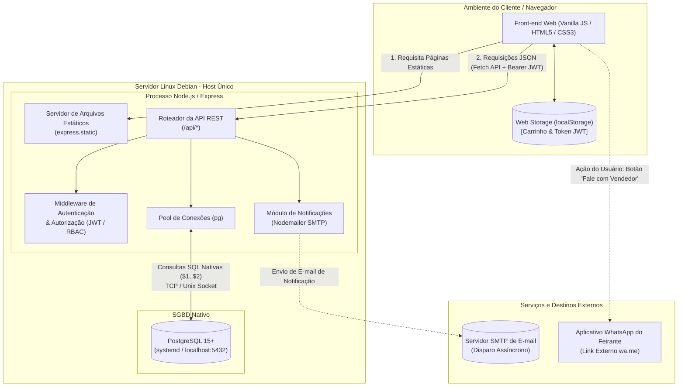
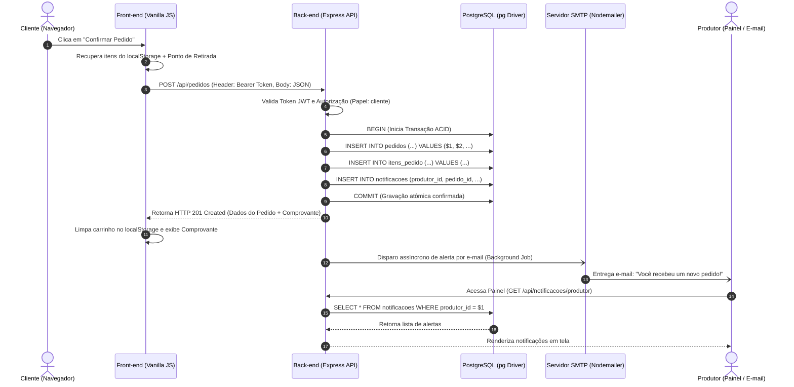

# Architecture: SISFEIRA

## 1. Visão Geral (Overview)

O **SISFEIRA** adota uma arquitetura monolítica modular simples e direta (Single-Host), concentrada em uma única instância de execução em ambiente Linux (Debian). A aplicação prioriza previsibilidade, baixo consumo de recursos e ausência de etapas complexas de compilação ou orquestração, entregando a API REST e os arquivos estáticos do front-end por meio do mesmo servidor HTTP Node.js/Express.

### 1.1 Diagrama de Componentes

---

### 1.2 Diagrama de Sequência: Fechamento de Pedido e Notificação

---

## 2. Stack Tecnológica (Stack)

| Camada | Tecnologia | Justificativa Arquitetural |
| :--- | :--- | :--- |
| **Runtime & Back-end** | Node.js (LTS) + Express.js | Simplicidade estrutural, alto desempenho I/O para operações assíncronas e controle pleno de rotas e middlewares sem camadas ocultas de abstração[cite: 1]. |
| **Front-end** | HTML5 Semântico, CSS3 (Flexbox/Grid), Vanilla JS (ES6+) | Entrega de interface ultraleve, sem necessidade de ferramentas de empacotamento/build, garantindo carregamento $\le$ 2s em smartphones (RNF01, RNF05)[cite: 1]. |
| **Banco de Dados** | PostgreSQL | Integridade referencial, conformidade transacional ACID no fechamento de pedidos e alta performance em agregações analíticas para relatórios (RF08)[cite: 1]. |
| **Acesso a Dados** | Driver nativo `pg` (node-postgres) | Uso de Connection Pooling nativo e queries SQL parametrizadas (`$1`, `$2`), eliminando overhead de ORMs e conferindo total previsibilidade operacional. |
| **Autenticação** | JWT (JSON Web Tokens) + `bcrypt` | Sessões stateless via tokens assinados, eliminando gestão de estado de sessão no servidor, combinadas com hashing criptográfico seguro para senhas (RNF02)[cite: 1]. |
| **Notificações** | Persistência Relacional + Nodemailer (SMTP) | Notificação interna via banco para consulta em painel, complementada por alerta transacional por e-mail, sem dependência de serviços externos pagos[cite: 1]. |
| **Infraestrutura** | Host Único Bare-Metal (Debian Linux) | Instalação nativa direta via `systemd` e gerenciador de pacotes, sem contêineres ou overhead de virtualização, adequado para desenvolvimento e execução ágil. |

---

## 3. Papel do Back-end (Backend)

O back-end opera como um monólito modular HTTP responsável por centralizar as regras de negócio, a persistência de dados e a segurança das operações[cite: 1]:
* **Roteamento e Controle de Fluxo:** Expõe uma API RESTful sob o prefixo `/api/*` tratando payloads estritamente em formato JSON[cite: 1].
* **Serviço de Arquivos Estáticos:** Utiliza o middleware nativo `express.static('frontend')` para servir o HTML, CSS e scripts da interface na mesma porta de execução (porta 3000), simplificando a topologia de rede.
* **Orquestração Transacional:** Gerencia transações SQL explícitas (`BEGIN`, `COMMIT`, `ROLLBACK`) durante o fechamento de pedidos e reserva de itens para evitar inconsistências de estoque ou compras incompletas.
* **Segurança e Isolamento Multi-Produtor:** Intercepta as requisições via middlewares de autorização, validando permissões (RBAC) e assegurando que um produtor jamais consulte ou modifique dados de outros feirantes (RN06)[cite: 1].

---

## 4. Papel do Front-end (Frontend)

O front-end é projetado como uma interface web progressiva, leve e sem dependências de compilação (Zero-Build-Step)[cite: 1]:
* **Responsividade e Desempenho:** Construído com CSS Grid e Flexbox nativos, otimizado para navegadores móveis utilizados por produtores e clientes (RNF01, RNF05)[cite: 1].
* **Consumo de API:** Realiza chamadas HTTP assíncronas via `fetch()` para a API Express, manipulando o DOM nativamente com JavaScript puro.
* **Estado Local da Sessão:** Mantém o carrinho de compras do cliente e o token JWT no `localStorage` do navegador, permitindo persistência entre recarregamentos de página sem sobrecarregar o back-end.
* **Canal Auxiliar de Contato:** Gera dinamicamente na tela de comprovante o link HTML padrão (`https://wa.me/<telefone>`), permitindo que o cliente inicie contato manual e voluntário com o feirante sem dependência de APIs da Meta.

---

## 5. Banco de Dados (Database)

A persistência do sistema é assegurada pelo SGBD relacional **PostgreSQL**[cite: 1]:
* **Confiabilidade e Integridade:** Aplicação estrita de restrições relacionais (`FOREIGN KEY`, `NOT NULL`, `CHECK`, `UNIQUE`) que garantem consistência entre usuários, produtos, edições de feira e itens do pedido[cite: 1].
* **Agilidade Analítica:** Execução de consultas analíticas diretas (`SUM`, `COUNT`, `GROUP BY`) com índices apropriados para a geração em tempo real dos relatórios de vendas por produtor (RF08)[cite: 1].
* **Connection Pooling:** O driver `pg` mantém um conjunto reutilizável de conexões abertas com o PostgreSQL, prevenindo o esgotamento de conexões durante picos de acesso nos dias de feira (RNF06)[cite: 1].

---

## 6. Estratégia de Segurança e Proteção (Security)

A segurança do SISFEIRA é implementada em camadas diretas de validação e isolamento (RNF02)[cite: 1]:
* **Hashing de Credenciais:** As senhas nunca são armazenadas em texto plano; utiliza-se o algoritmo `bcrypt` com salt rounds configurados na criação e validação de acessos.
* **Autenticação Stateless (JWT):** Geração de tokens assinados por chave secreta única contendo o ID e o papel do usuário (`cliente`, `produtor`, `admin`).
* **Autorização Baseada em Papéis (RBAC):** Middlewares barram acessos não autorizados antes da execução de qualquer controller da API.
* **Prevenção contra SQL Injection:** Proibição categórica de concatenação de strings em comandos SQL; todas as instruções utilizam parâmetros posicionais (`$1`, `$2`, etc.) tratados pelo driver PostgreSQL.
* **Isolamento de Escopo por Produtor (RN06):** O identificador do produtor é recuperado exclusivamente a partir do token decodificado pelo middleware e injetado diretamente nas cláusulas SQL (`WHERE produtor_id = $1`), impedindo adulteração de parâmetros via URL ou corpo da requisição[cite: 1].

### Análise de Riscos e Implicações de Segurança (Trade-offs do Projeto)
* **Armazenamento de JWT em `localStorage`:** 
  * *Risco Aceito:* Tokens armazenados em `localStorage` ficam vulneráveis à leitura caso a aplicação sofra ataques de Cross-Site Scripting (XSS).
  * *Justificativa no Contexto:* Solução simples e funcional para protótipos acadêmicos e MVPs sem a sobrecarga de configuração de cookies `HttpOnly` com flags `SameSite` e certificados HTTPS em localhost.
  * *Cenário Inadequado:* Não recomendado para ambientes de produção com dados financeiros sensíveis sem proteção rigorosa contra injeção de scripts (Content Security Policy e sanitização de DOM).
* **Execução em Host Único (Bare-Metal):**
  * *Risco Aceito:* O processo Node.js e o SGBD compartilham o mesmo espaço de memória e permissões de sistema operacional; um comprometimento severo do servidor web pode expor o banco local.
  * *Justificativa no Contexto:* Redução drástica de complexidade de implantação e dispensa de orquestradores (como Docker Compose ou Kubernetes) para avaliação acadêmica.

---

## 7. Infraestrutura e Ambiente (Infrastructure)

O ambiente de implantação é padronizado em **Linux (Debian)** de forma nativa e enxuta:
* **SGBD PostgreSQL:** Executado como serviço gerenciado pelo sistema operacional (`systemd`), ouvindo na porta padrão `5432` ou comunicando-se via Unix Domain Socket local.
* **Servidor Node.js:** Executado diretamente via Node runtime (`node src/server.js` ou scripts do `package.json`), gerenciando as requisições HTTP na porta `3000`.
* **Variáveis de Ambiente:** Configuração centralizada através de arquivo local `.env` (credenciais de banco, segredo do JWT e parâmetros SMTP), garantindo que dados sensíveis fiquem isolados do código-fonte.