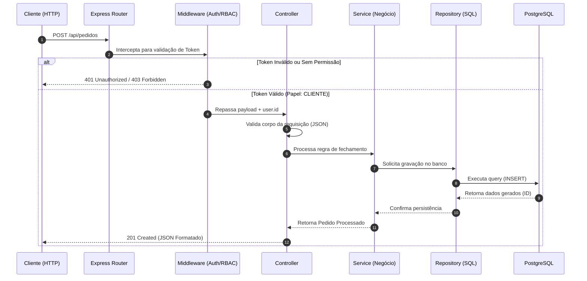

# Backend: SISFEIRA

## 1. Organização Física (Structure)

O código-fonte do back-end em Node.js está centralizado na pasta `src/`, adotando uma arquitetura modular orientada a domínios (feature-based) para facilitar a manutenção e legibilidade[cite: 3].

```text
src/
├── config/              # Configurações globais (Pool do banco, chaves JWT, SMTP)
├── middlewares/         # Interceptadores globais (Auth, tratamento de erros)
├── modules/             # Agrupamento lógico por funcionalidade do sistema
│   ├── auth/            # Roteamento, controle e serviços de autenticação
│   ├── catalog/         # Gestão de produtos e edições da feira
│   ├── order/           # Carrinho, emissão de pedidos e comprovantes
│   ├── notification/    # Disparo e consulta de alertas
│   └── report/          # Lógica analítica de vendas por produtor
│       ├── report.routes.js       # Definição das rotas REST
│       ├── report.controller.js   # Validação de I/O HTTP
│       ├── report.service.js      # Regras de negócio puras
│       └── report.repository.js   # Queries SQL nativas
├── server.js            # Ponto de entrada (Bootstrap do Express e rotas)
```

---

## 2. Roteamento (Routing)

O Express gerencia o roteamento distribuindo as requisições baseadas no prefixo da URL[cite: 3]. O arquivo principal `server.js` importa os arquivos de rotas de cada módulo (ex: `order.routes.js`) e os anexa sob o prefixo `/api`[cite: 3]. As rotas não contêm regras de negócio; elas apenas delegam a execução para os respectivos Controladores[cite: 3].

### 2.1 Diagrama de Ciclo de Vida da Requisição



---

## 3. Contrato de API (API Contract)

A comunicação com o front-end obedece a um padrão RESTful estrito, utilizando o formato JSON para troca de dados[cite: 3].
* **Requisições:** O cabeçalho `Content-Type: application/json` é obrigatório para rotas `POST`, `PUT` e `PATCH`[cite: 3]. O token de acesso deve ser enviado no cabeçalho `Authorization: Bearer <token>`[cite: 3].
* **Respostas de Sucesso:** Padronizadas para retornar diretamente o recurso solicitado em um objeto ou array (ex: `200 OK`, `201 Created`)[cite: 3].
* **Respostas de Erro:** Seguem um contrato fixo e previsível contendo a mensagem para a interface gráfica[cite: 3]:
  ```json
  {
    "erro": true,
    "mensagem": "Descrição clara do motivo da falha",
    "codigo": "CODIGO_INTERNO_ERRO"
  }
  ```

---

## 4. Serviços e Regras de Negócio (Services)

A camada `Service` é o coração da aplicação[cite: 3]. É aqui que os Requisitos Funcionais (RFs) e as Regras de Negócio (RNs) do sistema são transformados em código[cite: 3]. A camada de serviço não sabe que está rodando na web (desacoplada de objetos `req` e `res` do Express)[cite: 3].

* **Isolamento de Escopo (RN06):** No módulo de relatórios (`report.service.js`), o serviço sempre recebe o `produtor_id` extraído do token pelo middleware, garantindo que o relatório processe exclusivamente as vendas autorizadas[cite: 3].
* **Orquestração de Transações (RN02, RN03, RN04):** O `order.service.js` orquestra a criação do pedido, a geração do comprovante e o disparo da notificação em uma única chamada, passando o controle transacional (BEGIN/COMMIT) para o `order.repository.js`[cite: 3].

---

## 5. Acesso a Dados (Data Access)

Em conformidade com a arquitetura definida, o sistema interage com o PostgreSQL através de `Repositories` usando o driver nativo `pg` (node-postgres), descartando ORMs complexos para garantir controle, simplicidade e alto desempenho (RNF01)[cite: 3].

* **Connection Pool:** O gerenciamento de conexões é feito através de uma instância única de `Pool` em `config/db.js`, garantindo resiliência em dias de pico de acessos (RNF06)[cite: 3].
* **Queries Parametrizadas:** Toda e qualquer consulta SQL é blindada contra Injeção de SQL (RNF02) utilizando parâmetros posicionais obrigatórios[cite: 3].
  ```javascript
  // Padrão de repositório (exemplo abstrato)
  const query = `SELECT * FROM produtos WHERE produtor_id = $1 AND ativo = $2`;
  const result = await db.query(query, [produtorId, true]);
  ```
* **Gerenciamento de Transações (ACID):** Comandos de transação (`BEGIN`, `COMMIT`, `ROLLBACK`) não podem ser executados diretamente no pool global (ex: `db.query('BEGIN')`), pois o pool pode distribuir comandos subsequentes para conexões físicas diferentes. Em operações como o fechamento de pedidos, é obrigatório obter um cliente dedicado e garantir sua liberação no bloco `finally`:
  ```javascript
  const client = await pool.connect();
  try {
    await client.query('BEGIN');
    // INSERT INTO pedidos ...
    // INSERT INTO itens_pedido ...
    // INSERT INTO notificacoes ...
    await client.query('COMMIT');
  } catch (err) {
    await client.query('ROLLBACK');
    throw err;
  } finally {
    client.release(); // Libera a conexão de volta para o pool
  }
  ```

---

## 6. Middlewares (Interceptadores)

O back-end implementa middlewares essenciais para segurança e formatação (RNF02)[cite: 3]:

* **express.json():** Middleware nativo habilitado no `server.js` para realizar o parser automático do corpo de requisições de string para objetos JavaScript[cite: 3].
* **CORS (Cross-Origin Resource Sharing):** Embora back-end e front-end sejam servidos pela mesma porta (`3000`), as diretrizes de CORS são configuradas de forma restrita caso a API precise ser acessada de um domínio de teste futuro[cite: 3].
* **Autenticação (JWT):** Middleware `verifyToken` intercepta rotas protegidas, decodifica o token, injeta os dados do usuário em `req.user` e encerra a requisição em caso de expiração ou fraude[cite: 3].
* **Autorização (RBAC):** Middleware de fábrica `requireRole(['CLIENTE', 'PRODUTOR'])` garante que as operações exclusivas, como gerenciamento de catálogo, sejam executadas somente por usuários autorizados[cite: 3].

---

## 7. Tratamento de Exceções (Error Handling)

Para evitar vazamentos de informações sensíveis ou falhas silenciosas, o Express centraliza os erros por meio de um middleware global `errorHandler`, localizado no final da fila de rotas do `server.js`[cite: 3].

* **Abordagem Operacional e Captura Assíncrona:** No Express 4, exceções disparadas dentro de funções `async` não são capturadas automaticamente pelo middleware global de erro caso ocorra um reject fora de um bloco `try/catch`. Para evitar repetição excessiva de código, os controladores devem utilizar uma função utilitária `asyncHandler` que garante o repasse automático para o `errorHandler`:
  ```javascript
  const asyncHandler = (fn) => (req, res, next) => {
    Promise.resolve(fn(req, res, next)).catch(next);
  };
  ```
* **Padronização:** O middleware `errorHandler` mapeia erros conhecidos (como violações de chave única do banco de dados ou erro de validação JWT) e as converte na estrutura JSON definida no Contrato de API, retornando status `400`, `401`, ou `409` conforme o contexto[cite: 3].
* **Proteção de Dados (RNF02):** Em ambiente de produção, erros genéricos ou falhas críticas do PostgreSQL não expõem detalhes técnicos na API (retornando apenas HTTP `500 Internal Server Error` com uma mensagem amigável)[cite: 3].