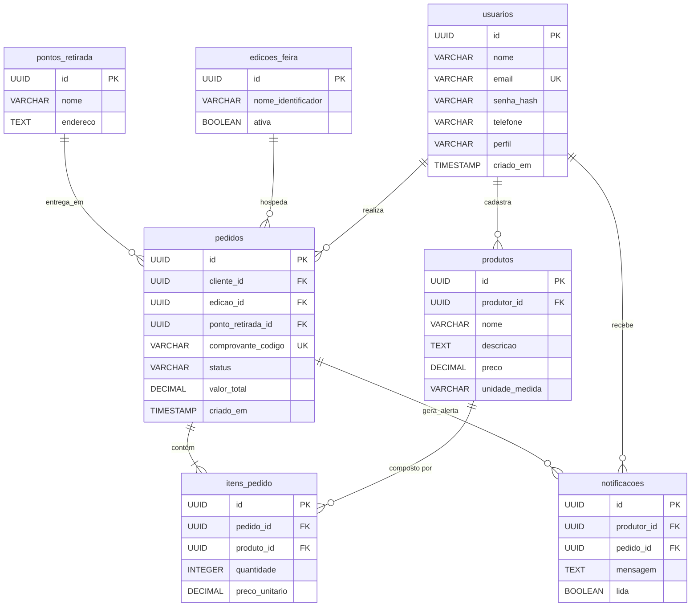

# Database: SISFEIRA

## 1. Esquema Físico (Schema)

O banco de dados relacional (PostgreSQL) foi projetado para garantir integridade referencial e consistência transacional[cite: 1], adotando chaves primárias do tipo `UUID` e restrições rigorosas (`FOREIGN KEY`, `NOT NULL`) para evitar dados órfãos.

### Tabela: `usuarios`
Armazena credenciais e perfis de acesso de todos os atores do sistema (Produtores, Clientes e Organização)[cite: 1].
| Coluna | Tipo (PostgreSQL) | Restrições | Descrição |
| :--- | :--- | :--- | :--- |
| `id` | `UUID` | `PRIMARY KEY`, `DEFAULT gen_random_uuid()` | Identificador único do usuário. |
| `nome` | `VARCHAR(150)` | `NOT NULL` | Nome completo ou razão social. |
| `email` | `VARCHAR(150)` | `NOT NULL`, `UNIQUE` | E-mail utilizado para autenticação. |
| `senha_hash` | `VARCHAR(255)` | `NOT NULL` | Hash da senha gerado via `bcrypt` (RNF02)[cite: 1]. |
| `telefone` | `VARCHAR(20)` | `NULL` | Contato (utilizado para o link do WhatsApp). |
| `perfil` | `VARCHAR(20)` | `NOT NULL`, `CHECK (perfil IN ('CLIENTE', 'PRODUTOR', 'ORGANIZACAO'))` | Papel do usuário no sistema[cite: 1]. |
| `criado_em` | `TIMESTAMP` | `DEFAULT CURRENT_TIMESTAMP` | Data de registro. |

### Tabela: `produtos`
Catálogo de itens agrícolas e artesanais ofertados[cite: 1].
| Coluna | Tipo (PostgreSQL) | Restrições | Descrição |
| :--- | :--- | :--- | :--- |
| `id` | `UUID` | `PRIMARY KEY`, `DEFAULT gen_random_uuid()` | Identificador único do produto. |
| `produtor_id` | `UUID` | `NOT NULL`, `REFERENCES usuarios(id)` | Vínculo com o produtor dono do item[cite: 1]. |
| `nome` | `VARCHAR(100)` | `NOT NULL` | Nome do produto. |
| `descricao` | `TEXT` | `NULL` | Detalhamento do produto. |
| `preco` | `DECIMAL(10,2)` | `NOT NULL`, `CHECK (preco >= 0)` | Preço de venda. |
| `unidade_medida`| `VARCHAR(20)` | `NOT NULL` | Ex: 'kg', 'unidade', 'maço'. |

### Tabela: `edicoes_feira`
Gerencia os ciclos de venda (semanas ou edições) em que os pedidos podem ser realizados[cite: 1].
| Coluna | Tipo (PostgreSQL) | Restrições | Descrição |
| :--- | :--- | :--- | :--- |
| `id` | `UUID` | `PRIMARY KEY`, `DEFAULT gen_random_uuid()` | Identificador único. |
| `nome_identificador`| `VARCHAR(100)` | `NOT NULL` | Ex: 'Feira Semana 42 - 2026'. |
| `ativa` | `BOOLEAN` | `DEFAULT FALSE` | Apenas uma edição deve estar ativa para receber compras (RN01)[cite: 1]. |

### Tabela: `pontos_retirada`
Locais físicos de logística[cite: 1].
| Coluna | Tipo (PostgreSQL) | Restrições | Descrição |
| :--- | :--- | :--- | :--- |
| `id` | `UUID` | `PRIMARY KEY`, `DEFAULT gen_random_uuid()` | Identificador único. |
| `nome` | `VARCHAR(150)` | `NOT NULL` | Nome do local de retirada[cite: 1]. |
| `endereco` | `TEXT` | `NOT NULL` | Endereço completo. |

### Tabela: `pedidos`
Cabeçalho das intenções de compra emitidas pelos clientes[cite: 1].
| Coluna | Tipo (PostgreSQL) | Restrições | Descrição |
| :--- | :--- | :--- | :--- |
| `id` | `UUID` | `PRIMARY KEY`, `DEFAULT gen_random_uuid()` | Identificador único. |
| `cliente_id` | `UUID` | `NOT NULL`, `REFERENCES usuarios(id)` | Cliente que realizou a compra[cite: 1]. |
| `edicao_id` | `UUID` | `NOT NULL`, `REFERENCES edicoes_feira(id)`| Edição da feira correspondente[cite: 1]. |
| `ponto_retirada_id`| `UUID` | `NOT NULL`, `REFERENCES pontos_retirada(id)`| Ponto de logística escolhido (RN05)[cite: 1]. |
| `comprovante_codigo`| `VARCHAR(20)`| `NOT NULL`, `UNIQUE` | Código gerado para o cliente (RN03)[cite: 1]. |
| `status` | `VARCHAR(30)` | `NOT NULL`, `CHECK (status IN ('RECEBIDO', 'EM_PREPARACAO', 'ENTREGUE'))` | Situação atual do pedido (RN02)[cite: 1]. |
| `valor_total` | `DECIMAL(10,2)`| `NOT NULL` | Soma consolidada dos itens. |
| `criado_em` | `TIMESTAMP` | `DEFAULT CURRENT_TIMESTAMP` | Data do registro da compra. |

### Tabela: `itens_pedido`
Itens individuais atrelados a um pedido, congelando os valores no momento da compra[cite: 1].
| Coluna | Tipo (PostgreSQL) | Restrições | Descrição |
| :--- | :--- | :--- | :--- |
| `id` | `UUID` | `PRIMARY KEY`, `DEFAULT gen_random_uuid()` | Identificador único. |
| `pedido_id` | `UUID` | `NOT NULL`, `REFERENCES pedidos(id) ON DELETE CASCADE`| Vínculo com o carrinho[cite: 1]. |
| `produto_id` | `UUID` | `NOT NULL`, `REFERENCES produtos(id)` | Vínculo com o catálogo[cite: 1]. |
| `quantidade` | `INTEGER` | `NOT NULL`, `CHECK (quantidade > 0)` | Volume comprado. |
| `preco_unitario`| `DECIMAL(10,2)`| `NOT NULL` | Preço do produto salvo no momento do fechamento. |

### Tabela: `notificacoes`
Alertas internos para os produtores sobre novos itens encomendados[cite: 1].
| Coluna | Tipo (PostgreSQL) | Restrições | Descrição |
| :--- | :--- | :--- | :--- |
| `id` | `UUID` | `PRIMARY KEY`, `DEFAULT gen_random_uuid()` | Identificador único. |
| `produtor_id` | `UUID` | `NOT NULL`, `REFERENCES usuarios(id)` | Produtor notificado (RN04)[cite: 1]. |
| `pedido_id` | `UUID` | `NOT NULL`, `REFERENCES pedidos(id)` | Pedido que gerou o alerta[cite: 1]. |
| `mensagem` | `TEXT` | `NOT NULL` | Corpo do alerta. |
| `lida` | `BOOLEAN` | `DEFAULT FALSE` | Controle de leitura no painel do produtor. |

---

## 2. Diagrama Entidade-Relacionamento Técnico (ER Diagram)



---

## 3. Procedures e Lógicas Armazenadas

Para manter o sistema coeso, simplificado e aderente à arquitetura em que o Node.js centraliza as regras de negócio, **não utilizaremos Stored Procedures complexas**.
* **Motivo:** A orquestração (como o cálculo do carrinho e a criação de múltiplas notificações por produtor) é executada no back-end (Express) abrindo uma transação SQL explícita (`BEGIN` e `COMMIT`). Isso facilita a depuração, mantém o banco de dados leve e prioriza a escalabilidade e manutenção via código da aplicação.

---

## 4. Triggers

Será utilizado apenas um gatilho de utilidade técnica (sem impacto nas regras de negócio), focado em auditoria:

* **Trigger de Atualização de Timestamp (`trigger_set_updated_at`):**
  Aplicado em tabelas chave (como `pedidos` e `produtos`) para atualizar automaticamente uma coluna `atualizado_em` caso os dados sejam alterados.
  * **Objetivo:** Evitar que a camada de código precise enviar manualmente o horário atual em comandos `UPDATE`.

---

## 5. Migrations (Migrações)

As migrações seguem uma abordagem enxuta sem uso de bibliotecas de terceiros (como Prisma ou Sequelize). As alterações no esquema são feitas através de scripts SQL puros localizados na pasta `src/database/migrations/`.

### Execução no Debian/Linux
As migrações são aplicadas sequencialmente pelo terminal utilizando o cliente `psql`:

```bash
# Exemplo de aplicação da primeira migração (Criação de Tabelas)
psql -U sisfeira_user -d sisfeira_db -f src/database/migrations/01_schema_inicial.sql
```

---

## 6. Seed Data (Dados Iniciais)

Para o ambiente de desenvolvimento e homologação acadêmica, scripts pré-definidos (`seed-data`) popularão o banco com os perfis esperados[cite: 1] e massa de testes.

### Execução do Seed
```bash
# Insere usuários (admin, produtores, clientes de teste) e produtos de exemplo
psql -U sisfeira_user -d sisfeira_db -f src/database/seeds/01_mock_data.sql
```

**Conteúdo esperado do Seed:**
1. Criação de pelo menos 1 usuário `ORGANIZACAO`[cite: 1].
2. Criação de 3 usuários `PRODUTOR` com hash de senha validado (`bcrypt`)[cite: 1].
3. Inserção de 15 a 20 `produtos` variados no catálogo[cite: 1].
4. Criação de 2 `pontos_retirada`[cite: 1].
5. Abertura de 1 `edicao_feira` ativa para testes de fluxo[cite: 1].