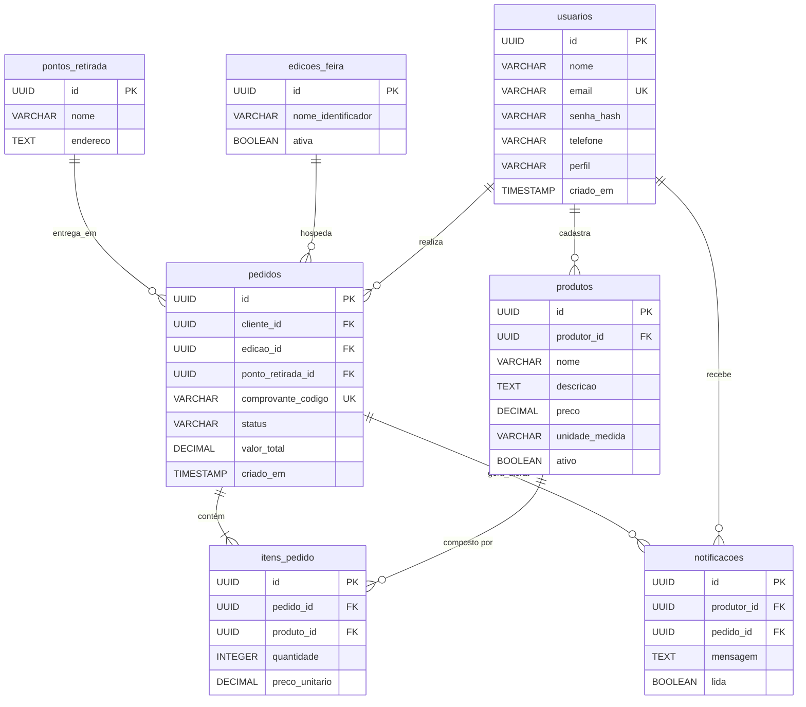

# Database: SISFEIRA

## 1. Esquema Físico (Schema)

O banco de dados relacional (PostgreSQL) foi projetado para garantir integridade referencial e consistência transacional[cite: 2], adotando chaves primárias do tipo `UUID` e restrições rigorosas (`FOREIGN KEY`, `NOT NULL`) para evitar dados órfãos[cite: 2].

### Tabela: `usuarios`
Armazena credenciais e perfis de acesso de todos os atores do sistema (Produtores, Clientes e Organização)[cite: 2].
| Coluna | Tipo (PostgreSQL) | Restrições | Descrição |
| :--- | :--- | :--- | :--- |
| `id` | `UUID` | `PRIMARY KEY`, `DEFAULT gen_random_uuid()` | Identificador único do usuário[cite: 2]. |
| `nome` | `VARCHAR(150)` | `NOT NULL` | Nome completo ou razão social[cite: 2]. |
| `email` | `VARCHAR(150)` | `NOT NULL`, `UNIQUE` | E-mail utilizado para autenticação[cite: 2]. |
| `senha_hash` | `VARCHAR(255)` | `NOT NULL` | Hash da senha gerado via `bcrypt` (RNF02)[cite: 2]. |
| `telefone` | `VARCHAR(20)` | `NULL`, `CHECK (perfil != 'PRODUTOR' OR telefone IS NOT NULL)` | Contato para link do WhatsApp. Obrigatório para o preenchimento no cadastro de produtores. |
| `perfil` | `VARCHAR(20)` | `NOT NULL`, `CHECK (perfil IN ('CLIENTE', 'PRODUTOR', 'ORGANIZACAO'))` | Papel do usuário no sistema[cite: 2]. |
| `criado_em` | `TIMESTAMP` | `DEFAULT CURRENT_TIMESTAMP` | Data de registro[cite: 2]. |

### Tabela: `produtos`
Catálogo de itens agrícolas e artesanais ofertados[cite: 2].
| Coluna | Tipo (PostgreSQL) | Restrições | Descrição |
| :--- | :--- | :--- | :--- |
| `id` | `UUID` | `PRIMARY KEY`, `DEFAULT gen_random_uuid()` | Identificador único do produto[cite: 2]. |
| `produtor_id` | `UUID` | `NOT NULL`, `REFERENCES usuarios(id)` | Vínculo com o produtor dono do item[cite: 2]. |
| `nome` | `VARCHAR(100)` | `NOT NULL` | Nome do produto[cite: 2]. |
| `descricao` | `TEXT` | `NULL` | Detalhamento do produto[cite: 2]. |
| `preco` | `DECIMAL(10,2)` | `NOT NULL`, `CHECK (preco >= 0)` | Preço de venda[cite: 2]. |
| `unidade_medida`| `VARCHAR(20)` | `NOT NULL` | Ex: 'kg', 'unidade', 'maço'[cite: 2]. |
| `ativo` | `BOOLEAN` | `DEFAULT TRUE` | Desativação lógica (Soft Delete) para manter a integridade referencial de pedidos antigos. |

### Tabela: `edicoes_feira`
Gerencia os ciclos de venda (semanas ou edições) em que os pedidos podem ser realizados[cite: 2].
| Coluna | Tipo (PostgreSQL) | Restrições | Descrição |
| :--- | :--- | :--- | :--- |
| `id` | `UUID` | `PRIMARY KEY`, `DEFAULT gen_random_uuid()` | Identificador único[cite: 2]. |
| `nome_identificador`| `VARCHAR(100)` | `NOT NULL` | Ex: 'Feira Semana 42 - 2026'[cite: 2]. |
| `ativa` | `BOOLEAN` | `DEFAULT FALSE` | Apenas uma edição deve estar ativa para receber compras (RN01)[cite: 2]. |

### Tabela: `pontos_retirada`
Locais físicos de logística[cite: 2].
| Coluna | Tipo (PostgreSQL) | Restrições | Descrição |
| :--- | :--- | :--- | :--- |
| `id` | `UUID` | `PRIMARY KEY`, `DEFAULT gen_random_uuid()` | Identificador único[cite: 2]. |
| `nome` | `VARCHAR(150)` | `NOT NULL` | Nome do local de retirada[cite: 2]. |
| `endereco` | `TEXT` | `NOT NULL` | Endereço completo[cite: 2]. |

### Tabela: `pedidos`
Cabeçalho das intenções de compra emitidas pelos clientes[cite: 2].
| Coluna | Tipo (PostgreSQL) | Restrições | Descrição |
| :--- | :--- | :--- | :--- |
| `id` | `UUID` | `PRIMARY KEY`, `DEFAULT gen_random_uuid()` | Identificador único[cite: 2]. |
| `cliente_id` | `UUID` | `NOT NULL`, `REFERENCES usuarios(id)` | Cliente que realizou a compra[cite: 2]. |
| `edicao_id` | `UUID` | `NOT NULL`, `REFERENCES edicoes_feira(id)`| Edição da feira correspondente[cite: 2]. |
| `ponto_retirada_id`| `UUID` | `NOT NULL`, `REFERENCES pontos_retirada(id)`| Ponto de logística escolhido (RN05)[cite: 2]. |
| `comprovante_codigo`| `VARCHAR(20)`| `NOT NULL`, `UNIQUE` | Código gerado para o cliente (RN03)[cite: 2]. |
| `status` | `VARCHAR(30)` | `NOT NULL`, `CHECK (status IN ('RECEBIDO', 'EM_PREPARACAO', 'ENTREGUE'))` | Situação atual do pedido (RN02)[cite: 2]. |
| `valor_total` | `DECIMAL(10,2)`| `NOT NULL` | Soma consolidada dos itens[cite: 2]. |
| `criado_em` | `TIMESTAMP` | `DEFAULT CURRENT_TIMESTAMP` | Data do registro da compra[cite: 2]. |

### Tabela: `itens_pedido`
Itens individuais atrelados a um pedido, congelando os valores no momento da compra[cite: 2].
| Coluna | Tipo (PostgreSQL) | Restrições | Descrição |
| :--- | :--- | :--- | :--- |
| `id` | `UUID` | `PRIMARY KEY`, `DEFAULT gen_random_uuid()` | Identificador único[cite: 2]. |
| `pedido_id` | `UUID` | `NOT NULL`, `REFERENCES pedidos(id) ON DELETE CASCADE`| Vínculo com o carrinho[cite: 2]. |
| `produto_id` | `UUID` | `NOT NULL`, `REFERENCES produtos(id)` | Vínculo com o catálogo[cite: 2]. |
| `quantidade` | `INTEGER` | `NOT NULL`, `CHECK (quantidade > 0)` | Volume comprado[cite: 2]. |
| `preco_unitario`| `DECIMAL(10,2)`| `NOT NULL` | Preço do produto salvo no momento do fechamento[cite: 2]. |

### Tabela: `notificacoes`
Alertas internos para os produtores sobre novos itens encomendados[cite: 2].
| Coluna | Tipo (PostgreSQL) | Restrições | Descrição |
| :--- | :--- | :--- | :--- |
| `id` | `UUID` | `PRIMARY KEY`, `DEFAULT gen_random_uuid()` | Identificador único[cite: 2]. |
| `produtor_id` | `UUID` | `NOT NULL`, `REFERENCES usuarios(id)` | Produtor notificado (RN04)[cite: 2]. |
| `pedido_id` | `UUID` | `NOT NULL`, `REFERENCES pedidos(id)` | Pedido que gerou o alerta[cite: 2]. |
| `mensagem` | `TEXT` | `NOT NULL` | Corpo do alerta[cite: 2]. |
| `lida` | `BOOLEAN` | `DEFAULT FALSE` | Controle de leitura no painel do produtor[cite: 2]. |

---

## 2. Índices de Otimização (Indexes)

Para assegurar o carregamento rápido do catálogo (RNF01) e acelerar as consultas agregadas de faturamento por produtor (RF08), os seguintes índices explícitos devem ser criados nas migrações:

```sql
CREATE INDEX idx_produtos_produtor ON produtos(produtor_id);
CREATE INDEX idx_pedidos_cliente ON pedidos(cliente_id, criado_em DESC);
CREATE INDEX idx_notificacoes_nao_lidas ON notificacoes(produtor_id) WHERE lida = FALSE;
CREATE INDEX idx_itens_pedido_agrupamento ON itens_pedido(produto_id);
```

---

## 3. Diagrama Entidade-Relacionamento Técnico (ER Diagram)



---

## 4. Procedures e Lógicas Armazenadas

Para manter o sistema coeso, simplificado e aderente à arquitetura em que o Node.js centraliza as regras de negócio, **não utilizaremos Stored Procedures complexas**[cite: 2].
* **Motivo:** A orquestração (como o cálculo do carrinho e a criação de múltiplas notificações por produtor) é executada no back-end (Express) abrindo uma transação SQL explícita (`BEGIN` e `COMMIT`)[cite: 2]. Isso facilita a depuração, mantém o banco de dados leve e prioriza a escalabilidade e manutenção via código da aplicação[cite: 2].

---

## 5. Triggers

Será utilizado apenas um gatilho de utilidade técnica (sem impacto nas regras de negócio), focado em auditoria[cite: 2]:

* **Trigger de Atualização de Timestamp (`trigger_set_updated_at`):**
  Aplicado em tabelas chave (como `pedidos` e `produtos`) para atualizar automaticamente uma coluna `atualizado_em` caso os dados sejam alterados[cite: 2].
  * **Objetivo:** Evitar que a camada de código precise enviar manualmente o horário atual em comandos `UPDATE`[cite: 2].

---

## 6. Migrations (Migrações)

As migrações seguem uma abordagem enxuta sem uso de bibliotecas de terceiros (como Prisma ou Sequelize)[cite: 2]. As alterações no esquema são feitas através de scripts SQL puros localizados na pasta `src/database/migrations/`[cite: 2].

### Execução no Debian/Linux
As migrações são aplicadas sequencialmente pelo terminal utilizando o cliente `psql`[cite: 2]:

```bash
# Exemplo de aplicação da primeira migração (Criação de Tabelas)
psql -U sisfeira_user -d sisfeira_db -f src/database/migrations/01_schema_inicial.sql
```

---

## 7. Seed Data (Dados Iniciais)

Para o ambiente de desenvolvimento e homologação acadêmica, scripts pré-definidos (`seed-data`) popularão o banco com os perfis esperados[cite: 2] e massa de testes[cite: 2].

### Execução do Seed
```bash
# Insere usuários (admin, produtores, clientes de teste) e produtos de exemplo
psql -U sisfeira_user -d sisfeira_db -f src/database/seeds/01_mock_data.sql
```

**Conteúdo esperado do Seed:**
1. Criação de pelo menos 1 usuário `ORGANIZACAO`[cite: 2].
2. Criação de 3 usuários `PRODUTOR` com hash de senha validado (`bcrypt`)[cite: 2].
3. Inserção de 15 a 20 `produtos` variados no catálogo[cite: 2].
4. Criação de 2 `pontos_retirada`[cite: 2].
5. Abertura de 1 `edicao_feira` ativa para testes de fluxo[cite: 2].