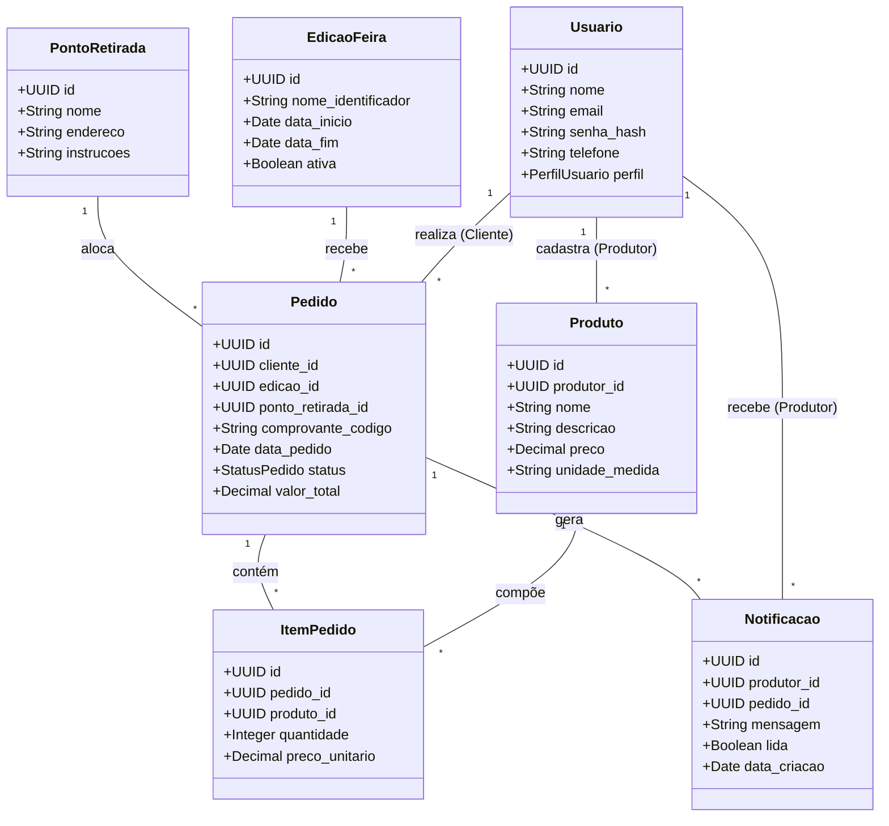
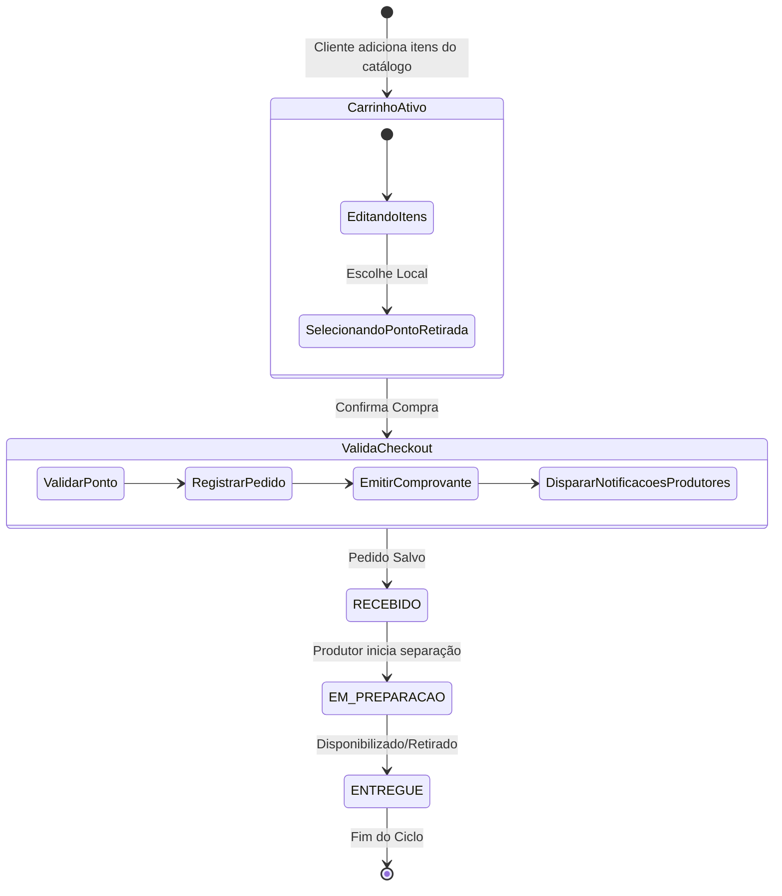

# Domain: SISFEIRA

## 1. Entidades Principais (Entities)

As entidades representam os objetos fundamentais do negócio no escopo do SISFEIRA:

* **Usuario:** Representa os indivíduos que interagem com o sistema, detendo credenciais de acesso e um perfil definido (Produtor, Cliente ou Organização)[cite: 1].
* **Produto:** Item agrícola ou artesanal cadastrado por um produtor, detalhando nome, descrição e preço[cite: 1].
* **EdicaoFeira:** Delimita o período de tempo (semana ou edição) em que o catálogo de produtos está ativo e disponível para recebimento de pedidos[cite: 1].
* **PontoRetirada:** Local físico definido pela organização para entrega ou recolhimento dos produtos encomendados pelos clientes[cite: 1].
* **Pedido:** Registro da intenção de compra consolidada por um cliente para uma edição da feira, possuindo um identificador único de comprovante e um status de atendimento[cite: 1].
* **ItemPedido:** Representa a quantidade e o preço congelado de um produto específico dentro de um carrinho/pedido[cite: 1].
* **Notificacao:** Alerta interno persistido, emitido para um produtor informando que novos itens de sua responsabilidade foram encomendados[cite: 1].

---

### 1.1 Diagrama de Classes de Domínio (Class Diagram)

---

## 2. Relacionamentos (Relationships)

* **Usuario (Produtor) $\leftrightarrow$ Produto:** Um produtor pode cadastrar e administrar múltiplos produtos no sistema[cite: 1]; cada produto pertence unicamente a um produtor.
* **Usuario (Cliente) $\leftrightarrow$ Pedido:** Um cliente pode realizar múltiplos pedidos ao longo do tempo (histórico)[cite: 1]; cada pedido é vinculado a um único cliente.
* **Pedido $\leftrightarrow$ EdicaoFeira:** Todo pedido é atrelado a uma única edição da feira em andamento[cite: 1].
* **Pedido $\leftrightarrow$ PontoRetirada:** A conclusão de todo pedido exige a definição de um (e apenas um) ponto de retirada/entrega[cite: 1].
* **Pedido $\leftrightarrow$ ItemPedido $\leftrightarrow$ Produto:** O pedido é um agrupador (carrinho) de vários itens; cada item faz referência a um produto específico[cite: 1] e congela o seu valor no momento da compra.
* **Pedido $\leftrightarrow$ Notificacao $\leftrightarrow$ Usuario (Produtor):** Um pedido contendo produtos de múltiplos feirantes gera uma notificação individual para cada produtor afetado[cite: 1].

---

## 3. Domínios de Valores Fixos (Enums)

Os seguintes valores categóricos governam as regras estritas de classificação do sistema:

### 3.1 PerfilUsuario
Identifica os tipos de atores e suas permissões operacionais:
* `CLIENTE`: Comprador que consulta o catálogo e emite pedidos[cite: 1].
* `PRODUTOR`: Agricultor/Feirante local que oferta produtos e gerencia o status dos itens encomendados[cite: 1].
* `ORGANIZACAO`: Gestão da feira que coordena pontos de retirada, edições e cadastros gerais[cite: 1].

### 3.2 StatusPedido
Define o ciclo de vida linear e rastreável de um atendimento:
* `RECEBIDO`: Estado inicial assumido automaticamente após a confirmação da compra pelo cliente e emissão do comprovante[cite: 1].
* `EM_PREPARACAO`: O produtor iniciou a separação ou embalagem dos produtos[cite: 1].
* `ENTREGUE`: O pedido foi disponibilizado e retirado pelo cliente no ponto designado, finalizando a jornada[cite: 1].

---

## 4. Lógicas de Aplicação (Use Cases)

A camada de domínio orquestra as regras puras de negócio (descritas no `product.md`) através das seguintes lógicas fundamentais:

* **Orquestração de Fechamento de Pedido:**
  1. Valida se a `EdicaoFeira` atual está ativa.
  2. Valida se o carrinho possui itens e se um `PontoRetirada` foi selecionado (RN05)[cite: 1].
  3. Registra o `Pedido` com status `RECEBIDO` (RN02) e salva os respectivos `ItemPedido`[cite: 1].
  4. Gera e anexa o código único do `Comprovante` (RN03)[cite: 1].
  5. Agrupa os produtos por `produtor_id` e dispara, em transação, a persistência na tabela de `Notificacao` para cada produtor correspondente (RN04)[cite: 1].

* **Isolamento de Dados de Vendas (Multi-Tenancy lógico para Produtores):**
  * Para gerar o relatório de vendas (RF08)[cite: 1], o domínio impõe obrigatoriamente um filtro (`WHERE produtor_id = ?`) em qualquer junção entre `Produto` e `ItemPedido`, garantindo que um produtor visualize estritamente o total vendido e faturado de sua própria colheita/produção, sem vazar dados de concorrentes (RN06)[cite: 1].

* **Transição Segura de Status:**
  * O domínio rejeita saltos arbitrários no ciclo de vida do pedido. Um produtor só pode mover o status seguindo o caminho formal estipulado no Enum `StatusPedido`[cite: 1].

---

### 4.1 Fluxo de Ciclo de Vida do Pedido (Activity Diagram)

