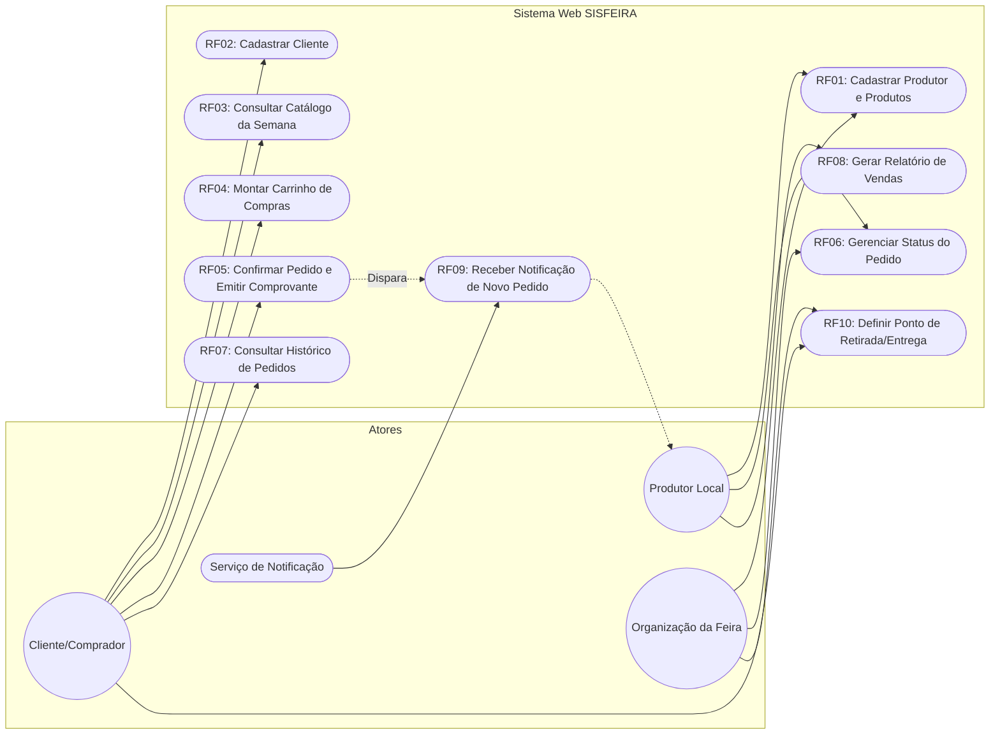
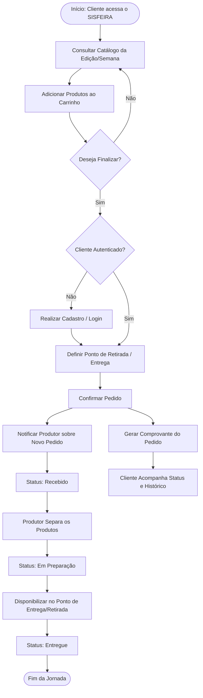

# Product: SISFEIRA

## 1. Visão do Produto (Vision)

* **Problema:** Produtores da agricultura familiar do Amazonas não possuem canal digital para divulgar produtos e receber pedidos antecipados dos clientes da feira, gerando desperdício de alimentos e limitando o alcance de suas vendas[cite: 1].
* **Objetivo Geral:** Desenvolver um sistema web para gestão de pedidos, catálogo de produtores e entregas de uma feira de produtores locais[cite: 1].
* **Objetivos Específicos:**
  * Permitir o cadastro de produtores e de seus respectivos produtos[cite: 1].
  * Disponibilizar um catálogo de produtos organizado por semana ou edição da feira[cite: 1].
  * Permitir que o cliente realize pedidos on-line com antecedência[cite: 1].
  * Acompanhar o status do pedido até a sua entrega ou retirada[cite: 1].

---

## 2. Escopo do Sistema (Scope)

### Dentro do Escopo (MVP)
* Cadastro e autenticação de usuários (produtores e clientes)[cite: 1].
* Cadastro e gerenciamento de produtos pelos produtores[cite: 1].
* Publicação e visualização de catálogo de produtos por semana/edição da feira[cite: 1].
* Carrinho de compras e fluxo de emissão de pedidos[cite: 1].
* Confirmação de pedidos com geração de comprovante para o comprador[cite: 1].
* Gerenciamento e acompanhamento de status do pedido (recebido, em preparação, entregue)[cite: 1].
* Consulta de histórico de compras por cliente[cite: 1].
* Geração de relatórios de vendas consolidados por produtor[cite: 1].
* Notificação aos produtores sobre novos pedidos recebidos[cite: 1].
* Configuração e exibição do ponto de retirada ou entrega do pedido[cite: 1].

### Fora do Escopo Inicial
* Processamento de pagamentos on-line via gateway bancário/cartão de crédito integrado (o sistema prevê confirmação e comprovante de pedido antecipado, sem liquidação financeira direta no escopo do MVP)[cite: 1].
* Rastreamento de entregas por geolocalização em tempo real (o sistema gerencia a definição do ponto e os status das etapas de atendimento)[cite: 1].
* Aplicativo mobile nativo (o sistema adota front-end web responsivo otimizado para dispositivos móveis)[cite: 1].

---

## 3. Atores do Sistema (Actors)

* **Cliente / Comprador(a):** Usuário que consulta o catálogo semanal, monta o carrinho de compras, finaliza pedidos, recebe comprovantes e acompanha o status de atendimento e histórico[cite: 1].
* **Produtor(a) Local:** Feirante/agricultor familiar que cadastra seus produtos, define disponibilidade na feira, recebe notificações de novos pedidos, atualiza o status de preparação/entrega e acompanha relatórios de vendas[cite: 1].
* **Organização da Feira:** Gestão responsável por supervisionar a feira, coordenar produtores e definir parâmetros operacionais (como edições da feira e pontos de entrega/retirada)[cite: 1].
* **Serviço de Notificações:** Componente/sistema de apoio responsável pelo disparo de avisos de novos pedidos aos produtores[cite: 1].

---

## 4. Glossário de Negócio (Glossary)

* **Agricultura Familiar:** Atividade agrícola realizada por pequenos produtores rurais, base dos feirantes atendidos pelo sistema no Amazonas[cite: 1].
* **Edição da Feira / Semana da Feira:** Período ou evento específico no qual determinado lote de produtos é ofertado e os pedidos são consolidados[cite: 1].
* **Pedido Antecipado:** Solicitação de compra montada pelo cliente antes da data ou horário de atendimento da feira, visando planejar a colheita e evitar perdas[cite: 1].
* **Ponto de Retirada / Entrega:** Local físico previamente estabelecido onde o cliente recolhe os produtos encomendados ou onde as entregas são coordenadas[cite: 1].
* **Comprovante de Pedido:** Documento/registro gerado após a confirmação da compra, contendo o resumo dos itens, valores e identificador para conferência na retirada[cite: 1].
* **Status do Pedido:** Estado atual da solicitação dentro do ciclo de atendimento: `recebido`, `em preparação` ou `entregue`[cite: 1].

---

## 5. Regras de Negócio (Business Rules)

* **RN01 – Temporalidade do Catálogo:** A disponibilização de produtos aos clientes é delimitada pela semana ou edição ativa da feira[cite: 1].
* **RN02 – Ciclo de Vida dos Pedidos:** Todo pedido deve evoluir exclusivamente pelos estados formais de atendimento: `recebido` $\rightarrow$ `em preparação` $\rightarrow$ `entregue`[cite: 1].
* **RN03 – Emissão de Comprovante:** A confirmação do pedido pelo cliente obrigatoriamente gera um comprovante descritivo para acompanhamento e retirada[cite: 1].
* **RN04 – Alerta de Pedido:** A criação de um novo pedido deve disparar imediatamente uma notificação para o produtor responsável pelos respectivos itens[cite: 1].
* **RN05 – Definição de Ponto de Atendimento:** Nenhum pedido pode ser concluído sem a definição explícita do ponto de retirada ou endereço de entrega configurado[cite: 1].
* **RN06 – Isolamento dos Relatórios de Produtor:** O relatório de vendas de um produtor deve consolidar estritamente as vendas dos seus próprios produtos[cite: 1].
* **RN07 – Autonomia Administrativa:** O gerenciamento e cadastro de produtos do catálogo devem ser realizados diretamente pela interface do produtor, sem necessidade de intervenção técnica ou programação[cite: 1].

---

## 6. Requisitos do Sistema (Requirements)

### 6.1 Requisitos Funcionais (RF)

| Identificador | Descrição | Regra / Ator Relacionado |
| :--- | :--- | :--- |
| **RF01**[cite: 1] | Cadastrar produtores e seus respectivos produtos[cite: 1]. | RN07 / Produtor, Organização[cite: 1] |
| **RF02**[cite: 1] | Cadastrar clientes/compradores[cite: 1]. | Cliente[cite: 1] |
| **RF03**[cite: 1] | Disponibilizar catálogo de produtos por semana ou edição da feira[cite: 1]. | RN01 / Cliente, Produtor[cite: 1] |
| **RF04**[cite: 1] | Permitir que o cliente monte um pedido (carrinho de compras)[cite: 1]. | Cliente[cite: 1] |
| **RF05**[cite: 1] | Confirmar o pedido e gerar comprovante para o cliente[cite: 1]. | RN03 / Cliente[cite: 1] |
| **RF06**[cite: 1] | Gerenciar o status do pedido (recebido, em preparação, entregue)[cite: 1]. | RN02 / Produtor, Organização[cite: 1] |
| **RF07**[cite: 1] | Consultar o histórico de pedidos por cliente[cite: 1]. | Cliente[cite: 1] |
| **RF08**[cite: 1] | Gerar relatório de vendas por produtor[cite: 1]. | RN06 / Produtor[cite: 1] |
| **RF09**[cite: 1] | Notificar o produtor sobre novos pedidos recebidos[cite: 1]. | RN04 / Serviço de Notificações, Produtor[cite: 1] |
| **RF10**[cite: 1] | Definir o ponto de retirada/entrega do pedido[cite: 1]. | RN05 / Organização, Cliente[cite: 1] |

### 6.2 Requisitos Não Funcionais (RNF)

| Identificador | Categoria | Descrição |
| :--- | :--- | :--- |
| **RNF01**[cite: 1] | **Desempenho**[cite: 1] | Carregar o catálogo de produtos em até 2 segundos[cite: 1]. |
| **RNF02**[cite: 1] | **Segurança**[cite: 1] | Proteger os dados de clientes e produtores cadastrados[cite: 1]. |
| **RNF03**[cite: 1] | **Usabilidade**[cite: 1] | Processo de pedido simples, realizável em poucos cliques[cite: 1]. |
| **RNF04**[cite: 1] | **Disponibilidade**[cite: 1] | Manter-se disponível nos dias e horários de maior demanda (dias de feira)[cite: 1]. |
| **RNF05**[cite: 1] | **Portabilidade**[cite: 1] | Layout responsivo, otimizado para uso em smartphones[cite: 1]. |
| **RNF06**[cite: 1] | **Escalabilidade**[cite: 1] | Suportar picos de acesso em dias de feira sem perda de desempenho[cite: 1]. |
| **RNF07**[cite: 1] | **Manutenibilidade**[cite: 1] | Catálogo de produtos administrável sem necessidade de programação[cite: 1]. |

---

### 6.3 Diagrama de Casos de Uso

---

### 6.4 Diagrama de Fluxograma da Jornada (User Flow)

